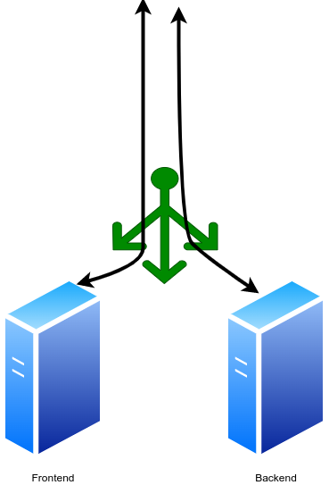
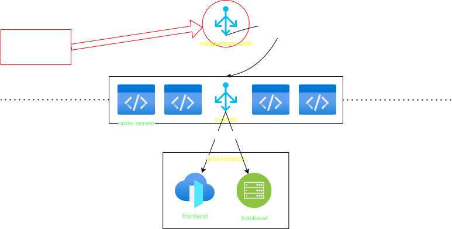

# 一個簡單的 C++ 網頁專案

## 初衷
一個簡單給學弟接觸專案型 C++ 的練習專案

預期這個專案會給學弟來幾項學習內容：

詳見[投影片 404 撰寫中](/foo/bar/DUMMMMMY)

## 預期架構
```
-(root)                 # 本目錄
├── backend             # 後端邏輯
├── edit_instance       # 現場開放編輯的共用 IDE，(試運行？)
├── frontend            # 前端邏輯
├── auto-update         # 自動部屬
└── swag                # 反向代理
```

### 運行拓撲




## 現場開發模式
- code server 小組合作開發
- 推上 GitHub 觸發 webhook 並且過我的 CircleCI(?)
- CI 推上 dockerhub 後觸發 auto-update 拉到 local 重起 web-instance

## 如何構建？


